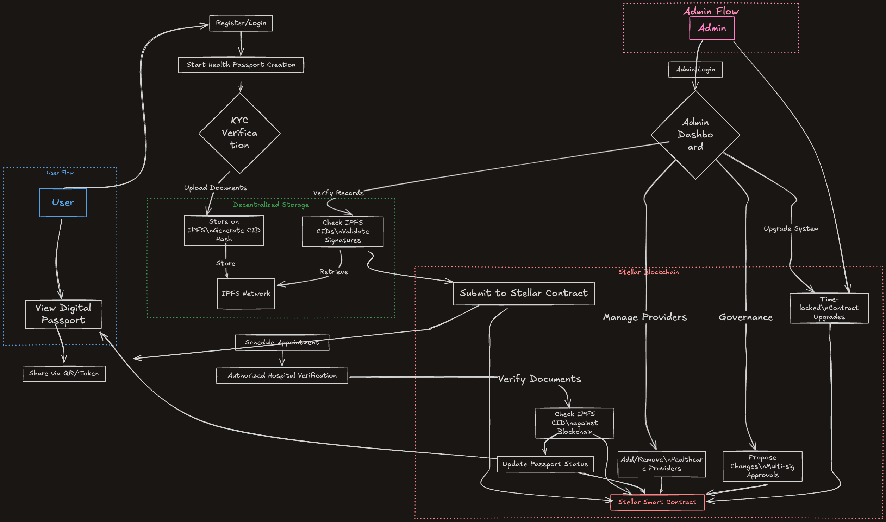

<div align="center">
  
</div>

A decentralized health record management system powered by Stellar blockchain technology, providing secure, verifiable, and portable health credentials.

## Table of Contents

- Why StellarMed?
- Use Cases
- App Architecture
  - Smart Contract
  - Frontend Application
  - Wallet Integration
- Key Features
- Security Model
- Installation and Setup
- Development
- License

## Why StellarMed?

Healthcare data management faces numerous challenges:

- **Fragmentation**: Medical records are scattered across different healthcare providers
- **Accessibility**: Patients often lack control over their own health data
- **Verification**: Proving the authenticity of health credentials is complex
- **Privacy**: Ensuring data is shared only with authorized parties
- **Interoperability**: Systems often can't communicate with each other

StellarMed addresses these challenges by leveraging the Stellar blockchain to create a secure, patient-controlled health passport that:

- **Empowers patients** to own and control their medical data
- **Provides verifiability** through cryptographic proof and immutable records
- **Ensures privacy** through encryption and permission-based access
- **Creates a global standard** that works across healthcare systems
- **Reduces fraud** in health credentials through blockchain verification

## Use Cases

### For Patients

- **Health Passport**: Create a comprehensive digital health identity
- **Record Management**: Securely store and access medical history
- **Credential Sharing**: Selectively share medical information with providers
- **Travel Verification**: Prove vaccination or health status when traveling
- **Emergency Access**: First responders can access critical information

### For Healthcare Providers

- **Record Access**: Quickly access patient history with permission
- **Record Creation**: Add new medical records to a patient's health passport
- **Verification**: Verify the authenticity of existing health records
- **Prescription Management**: Track medication prescriptions securely

### For Administrators

- **System Governance**: Multi-signature administration of the system
- **Provider Management**: Register and verify legitimate healthcare providers
- **Compliance Enforcement**: Ensure adherence to healthcare regulations

### For Verifiers

- **Credential Validation**: Quickly verify health credentials without accessing full records
- **QR Code Scanning**: Simple verification through secure QR codes
- **Identity Confirmation**: Confirm the identity of credential holders

## App Architecture

StellarMed follows a modern blockchain application architecture:

<div align="center">
  
</div>

### Smart Contract

The StellarMed platform is built on [Soroban](https://soroban.stellar.org/), Stellar's smart contract platform:

- **Contract Language**: Rust
- **Contract Structure**:
  - `HealthCareContract`: Main contract managing health records and permissions
  - Multi-signature admin management
  - Provider registration and verification
  - Health record storage and access control

Key contract components:

- Admin management with multi-signature governance
- Provider registration and status management
- Health record creation, verification, and updates
- Permission-based access controls

### Frontend Application

The frontend is built with modern web technologies:

- **Framework**: React 19 with TypeScript
- **Routing**: React Router v7
- **Styling**: TailwindCSS 4.x
- **Build Tool**: Vite 6.x

Key frontend components:

- Wallet connection with Freighter integration
- Health passport creation workflow
- Health record visualization
- Admin dashboard for governance
- Provider management interface

### Wallet Integration

StellarMed uses [Freighter](https://www.freighter.app/) for wallet integration:

- **Authentication**: Secure identity verification through Stellar wallets
- **Transaction Signing**: Cryptographic signing of all blockchain operations
- **Key Management**: Users maintain control of their private keys
- **Networks**: Support for multiple Stellar networks (Testnet, Public, Future)

## Key Features

### Health Passport Management

- Create digital health passports with blockchain verification
- Upload and manage health records
- Generate verifiable QR codes for credentials
- Track medical history securely

### Provider System

- Healthcare provider registration and verification
- Provider credential management
- Record creation permissions
- Provider status management

### Admin Governance

- Multi-signature administrative control
- Provider authorization
- System parameter configuration
- Emergency controls

### Security and Privacy

- Cryptographic verification of all records
- Selective disclosure of health information
- Permission-based access controls
- Immutable audit trail

## Security Model

StellarMed implements multiple layers of security:

1. **Blockchain Security**: All records are cryptographically secured on the Stellar blockchain
2. **Multi-signature Governance**: Administrative actions require multiple approvals
3. **Role-Based Access Control**: Different user types have appropriate permissions
4. **Client-Side Encryption**: Sensitive data is encrypted before storage
5. **Authentication**: Strong wallet-based authentication
6. **Authorization**: Fine-grained permission controls for data access

## Installation and Setup

### Smart Contract Deployment

1. Install Rust and the Soroban CLI:

   ```bash
   curl --proto '=https' --tlsv1.2 -sSf https://sh.rustup.rs | sh
   cargo install soroban-cli
   ```

2. Build the contract:

   ```bash
   cd stellar-med-contract/contracts/MedContract
   stellar contract build
   ```

3. Deploy to Stellar network:
   ```bash
   stellar contract deploy \
     --wasm target/wasm32-unknown-unknown/release/MedContract.wasm \
     --source <SOURCE_ACCOUNT> \
     --network testnet
   ```

### Frontend Setup

1. Install dependencies:

   ```bash
   cd StellarMed-Frontend
   npm install
   ```

2. Configure environment variables:

   ```bash
   cp .env.example .env
   # Edit .env with your contract ID and network preferences
   ```

3. Start development server:

   ```bash
   npm run dev
   ```

4. Build for production:
   ```bash
   npm run build
   ```

## Development

### Requirements

- Node.js 18+
- Rust 1.69+
- Stellar account with funds
- Freighter wallet browser extension

### Testing

For smart contract:

```bash
cd stellar-med-contract/contracts/MedContract
cargo test
```

For frontend:

```bash
cd StellarMed-Frontend
npm run test
```

## License

This project is licensed under the MIT License - see the LICENSE file for details.

---

Built with ❤️ for the [Stellar Hackathon](https://stellar.org)
